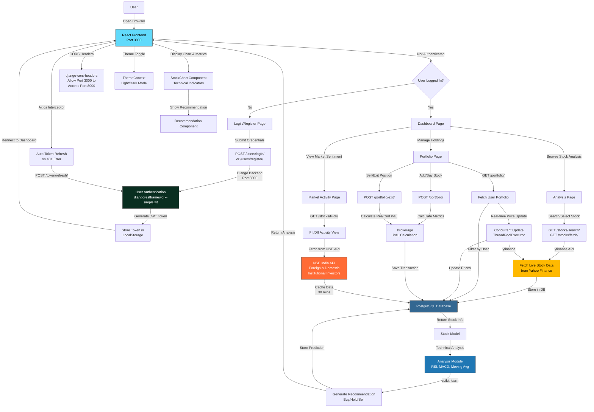

# Stock Analysis Project - Flow & Technology Stack

## 📊 PROJECT FLOWCHART



---

## 🛠️ TECHNOLOGY STACK

### **BACKEND TECHNOLOGIES**

#### 1. **Django 6.0+** 
- **What it is**: Web framework for building REST APIs
- **What it does**: Handles request routing, business logic, database operations
- **Why chosen**:
  - ✅ Built-in security (SQL injection, XSS, CSRF protection)
  - ✅ Admin panel for database management
  - ✅ ORM for database abstraction (no raw SQL)
  - ✅ Mature & battle-tested for financial applications
  - ✅ Easy to learn (college project)

---

#### 2. **Django REST Framework (DRF)** 
- **What it is**: Toolkit for building REST APIs on top of Django
- **What it does**: Converts Django models to JSON APIs, handles serialization
- **Why chosen**:
  - ✅ Reduces boilerplate (ListCreateAPIView, RetrieveUpdateDestroyAPIView)
  - ✅ Built-in authentication classes
  - ✅ Automatic pagination & filtering
  - ✅ Permission & throttling support
  - Used for: `/api/stocks/`, `/api/portfolio/`, `/api/users/` endpoints

---

#### 3. **djangorestframework-simplejwt**
- **What it is**: JWT authentication for stateless APIs
- **What it does**: Generates access & refresh tokens for user sessions
- **Why chosen**:
  - ✅ Perfect for React SPA (frontend can store tokens in localStorage)
  - ✅ No server-side session storage needed
  - ✅ Access token (1hr) + Refresh token (7d) strategy
  - ✅ Auto token refresh via Axios interceptor
  - Used for: User login, token validation, permission checks

---

#### 4. **django-cors-headers**
- **What it is**: Middleware to handle Cross-Origin Resource Sharing
- **What it does**: Allows React (port 3000) to make requests to Django (port 8000)
- **Why chosen**:
  - ✅ Browser enforces Same-Origin Policy
  - ✅ Adds `Access-Control-Allow-*` headers to enable cross-origin requests
  - ✅ Development & production ready

---

#### 5. **PostgreSQL (via psycopg2-binary)**
- **What it is**: Production-grade relational database
- **What it does**: Stores all application data (stocks, portfolios, users, predictions)
- **Why chosen**:
  - ✅ ACID compliance for financial transactions
  - ✅ Handles large time-series data (StockHistory)
  - ✅ Foreign key integrity for relational data
  - ✅ Better than SQLite for production
  - ✅ Fallback to SQLite in settings.py for development

---

#### 6. **yfinance**
- **What it is**: Python library to fetch stock data from Yahoo Finance
- **What it does**: Retrieves real-time & historical stock prices, volumes, OHLC data
- **Why chosen**:
  - ✅ Free, no API key required
  - ✅ Supports Indian stocks (e.g., `RELIANCE.NS`, `TCS.NS`)
  - ✅ Historical data for technical analysis
  - Used for: `fetchStock()`, portfolio price updates

---

#### 7. **pandas & numpy**
- **What it is**: Data manipulation & numerical computing libraries
- **What it does**: Process stock price arrays, calculate indicators
- **Why chosen**:
  - ✅ Industry standard for financial data analysis
  - ✅ Efficient series/dataframe operations
  - ✅ Built-in NaN/infinite value handling
  - Used for: RSI, MACD, Moving Averages calculations

---

#### 8. **scikit-learn**
- **What it is**: Machine learning library
- **What it does**: Could be used for prediction models (Buy/Hold/Sell recommendations)
- **Why chosen**:
  - ✅ Multiple classifiers available
  - ✅ Data preprocessing utilities
  - ✅ Cross-validation, model evaluation
  - Note: Current implementation uses technical indicators, not ML models

---

### **FRONTEND TECHNOLOGIES**

#### 1. **React 19.2.7**
- **What it is**: JavaScript library for building UIs
- **What it does**: Renders components, manages state, handles user interactions
- **Why chosen**:
  - ✅ Component-based architecture
  - ✅ Virtual DOM for efficient rendering
  - ✅ Large ecosystem (routing, HTTP, state management)
  - ✅ Easy to learn (college project)

---

#### 2. **React Router DOM 7.18.0**
- **What it is**: Routing library for Single Page Applications (SPA)
- **What it does**: Maps URLs to React components
- **Why chosen**:
  - ✅ Dynamic routing (e.g., `/analysis?symbol=RELIANCE`)
  - ✅ Protected routes (ProtectedRoute wrapper)
  - ✅ Query parameter handling
  - Routes implemented:
    - `/login` → Login page
    - `/register` → Register page
    - `/` → Dashboard (protected)
    - `/analysis` → Stock analysis (protected)
    - `/portfolio` → User holdings (protected)
    - `/market-activity` → FII/DII sentiment (protected)

---

#### 3. **Axios 1.18.1**
- **What it is**: HTTP client for making API requests
- **What it does**: Sends GET/POST/PATCH/DELETE requests to Django backend
- **Why chosen**:
  - ✅ Promise-based (works with async/await)
  - ✅ Request/response interceptors
  - ✅ Auto token refresh on 401 errors
  - Used for: All API calls to `/api/users/`, `/api/stocks/`, `/api/portfolio/`

---

#### 4. **React Context API**
- **What it is**: State management built into React
- **What it does**: Shares global state across components (AuthContext, ThemeContext)
- **Why chosen**:
  - ✅ No external library needed
  - ✅ User authentication state (logged in, user profile)
  - ✅ Theme state (light/dark mode)
  - ✅ Simpler than Redux for this project scale

---

#### 5. **react-scripts 5.0.1**
- **What it is**: Build & development tools (Webpack, Babel, ESLint)
- **What it does**: Builds React code for production, provides dev server
- **Why chosen**:
  - ✅ Comes with Create React App
  - ✅ Zero-config webpack setup
  - ✅ HMR (hot module reloading) for development

---

### **DATA ANALYSIS TECHNOLOGIES**

#### 1. **Technical Indicators (Python)**
The backend implements three core financial indicators:

**RSI (Relative Strength Index)**
- Measures momentum on 0-100 scale
- Values < 30 = Oversold (buy signal)
- Values > 70 = Overbought (sell signal)
- Implementation: `calculate_rsi()` in analysis.py

**MACD (Moving Average Convergence Divergence)**
- Trend-following momentum indicator
- MACD = 12-EMA - 26-EMA
- Signal = 9-EMA of MACD
- Buy when MACD > Signal, Sell when MACD < Signal
- Implementation: `calculate_macd()` in analysis.py

**Moving Averages (20-day & 50-day)**
- Smooths price data
- MA20 > MA50 = Uptrend
- MA20 < MA50 = Downtrend
- Implementation: `calculate_moving_averages()` in analysis.py

---

#### 2. **FII/DII Data (NSE India API)**
- **FII** = Foreign Institutional Investors
- **DII** = Domestic Institutional Investors
- **What it measures**: Market sentiment & capital flows
- **Data fetched**: Buy value, Sell value, Net value
- **Cache**: 30 minutes to reduce API calls
- **Why**: Institutional investor activity influences stock prices

---

### **DEPLOYMENT & INFRASTRUCTURE**

#### Development Setup:
```
Frontend:  npm start          → React dev server on port 3000
Backend:   python manage.py runserver → Django dev server on port 8000
Database:  PostgreSQL running locally or SQLite fallback
```

#### Production deployment (when ready):
- Frontend: Build → `npm build` → Deploy to Nginx/Vercel
- Backend: Django + Gunicorn + Nginx reverse proxy
- Database: Managed PostgreSQL (AWS RDS, Azure Database, etc.)

---

## 📝 DATA FLOW SUMMARY

### **User Registration & Authentication Flow**
```
User Input → React Form → POST /users/register/ → Django
→ Create User → Generate JWT Tokens → Store in localStorage
→ Redirect to Dashboard
```

### **Stock Analysis Flow**
```
User Search → React → GET /stocks/fetch/{symbol}/ → Django
→ yfinance API (Yahoo Finance) → Store in PostgreSQL
→ Technical Analysis (RSI, MACD, MA) → Generate Recommendation
→ Return to React → Display StockChart + Recommendation
```

### **Portfolio Management Flow**
```
User Buys Stock → POST /portfolio/ → Django calculates brokerage
→ Store in PostgreSQL → On Portfolio view:
→ Fetch all holdings → Concurrent price update (ThreadPoolExecutor)
→ yfinance → Update current_price → Calculate Unrealized P&L
→ Display to user
```

### **Portfolio Exit Flow**
```
User Sells Stock → POST /portfolio/{id}/exit/ → Django
→ Calculate: Realized P&L = (exit_price - buy_price) × qty - brokerage
→ Mark as "exited" → Update database
→ Display exit summary to user
```

---

## 🔒 SECURITY FEATURES

1. **JWT Authentication**: Stateless, token-based auth
2. **CORS Headers**: Restricts requests to allowed origins
3. **Django Security Middleware**:
   - CSRF protection
   - SQL injection prevention (ORM)
   - XSS protection
   - Clickjacking protection
4. **Password Validation**: Built-in Django validators
5. **Brokerage Rates**: Hardcoded in models (0.15% buy, 0.15% sell)

---

## 📦 PROJECT DEPENDENCIES

### Backend (requirements.txt)
```
Django >= 6.0                          (Web framework)
djangorestframework >= 3.14            (REST APIs)
djangorestframework-simplejwt >= 5.5   (JWT authentication)
django-cors-headers >= 4.0             (CORS handling)
psycopg2-binary >= 2.9                 (PostgreSQL adapter)
yfinance >= 0.2                        (Stock data)
pandas >= 2.0                          (Data manipulation)
numpy >= 1.24                          (Numerical computing)
scikit-learn >= 1.3                    (ML/analytics)
```

### Frontend (package.json)
```
react >= 19.2.7                        (UI library)
react-dom >= 19.2.7                    (React DOM binding)
react-router-dom >= 7.18.0             (Routing)
axios >= 1.18.1                        (HTTP client)
react-scripts >= 5.0.1                 (Build tools)
```

---

## 🎯 KEY FEATURES MAPPED TO TECH

| Feature | Technology | Why |
|---------|-----------|-----|
| User Authentication | JWT (simplejwt) | Stateless, SPA-friendly |
| Stock Data Fetching | yfinance | Free, reliable, no key needed |
| Technical Analysis | pandas, numpy | Efficient numerical operations |
| Buy/Sell Recommendations | Python logic + scikit-learn | Rule-based + potential ML models |
| Real-time Prices | yfinance + ThreadPoolExecutor | Concurrent updates, non-blocking |
| Portfolio Tracking | PostgreSQL ORM | ACID compliance for transactions |
| FII/DII Sentiment | NSE API + caching | Live market sentiment |
| Frontend Routing | React Router | Dynamic SPA with protected routes |
| State Management | React Context | Global auth & theme state |
| HTTP Requests | Axios | Auto token refresh capability |
| Cross-Origin Requests | django-cors-headers | Enable React ↔ Django communication |

---

## 💡 ARCHITECTURE SUMMARY

```
┌─────────────────────────────────────────────────────────────┐
│                    React Frontend (Port 3000)                │
│  ┌──────────────┐  ┌──────────────┐  ┌──────────────┐       │
│  │  Dashboard   │  │   Analysis   │  │  Portfolio   │       │
│  └──────────────┘  └──────────────┘  └──────────────┘       │
│       ↓ Axios + JWT ↓        ↓ Axios ↓       ↓ Axios ↓      │
├─────────────────────────────────────────────────────────────┤
│                    CORS Headers (Port 8000)                  │
├─────────────────────────────────────────────────────────────┤
│              Django REST Framework Backend                    │
│  ┌──────────────┐  ┌──────────────┐  ┌──────────────┐       │
│  │ Auth Views   │  │ Stock Views  │  │ Portfolio    │       │
│  │ (JWT)        │  │ (Analysis)   │  │ Views        │       │
│  └──────────────┘  └──────────────┘  └──────────────┘       │
│       ↓              ↓                ↓                      │
├─────────────────────────────────────────────────────────────┤
│              PostgreSQL Database                             │
│  ┌─────────┐  ┌──────────┐  ┌──────────┐  ┌──────────┐      │
│  │  Users  │  │  Stocks  │  │ Portfolio│  │StockHist │      │
│  └─────────┘  └──────────┘  └──────────┘  └──────────┘      │
└─────────────────────────────────────────────────────────────┘
         ↓ (Data fetch)        ↓ (Live prices)
    ┌─────────────┐        ┌──────────────┐
    │ yfinance    │        │ NSE API      │
    │ Yahoo Fin   │        │ FII/DII      │
    └─────────────┘        └──────────────┘
```

---

## 🚀 SCALABILITY & FUTURE ENHANCEMENTS

### Current Bottlenecks:
- yfinance throttling (free API limits)
- Sequential stock analysis (could be async)
- No caching for analysis results

### Potential Improvements:
- Migrate to Celery + Redis for async tasks
- Add WebSocket for real-time price updates
- Implement Redis caching for frequently analyzed stocks
- Add Docker containerization
- Migrate to microservices (auth, stocks, portfolio as separate services)
- Add ML models for better predictions
- Implement backtesting framework

